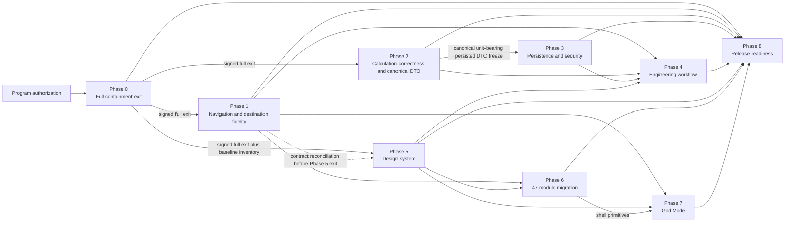

# V8 Remediation and Product Redesign Program

## Executive Status

**Program state:** Approved for phased implementation; remediation work has not been accepted as production-ready.

**Release posture:** Risk-first containment. The existing V8 integration is structurally substantial, but its original `COMPLETED` labels are implementation claims, not acceptance evidence. The audited implementation contains two critical and eight high findings. Engineering calculations and controlled calculation records must not be represented as professionally validated until the applicable phase gates have passed.

**Scope:** Remediate the Engineering Calculation Hub, persistence and security, navigation, workflow integration, and God Mode; establish an evolved V8 design system; migrate all 47 modules; and produce release evidence. Preserve the recognizable Architex teal, deep-ink, mint, origami, and Datum visual language while improving semantics, accessibility, responsiveness, and consistency.

**Authority:** This index operationalizes the approved [V8 remediation program design](../superpowers/specs/2026-08-23-v8-remediation-redesign-program-design.md) and the audited [original V8 integration plan](../V8_ENGINEERING_GODMODE_INTEGRATION_PLAN.md). If a downstream phase document conflicts with this index on estimates, Phase 0 sequencing, Phase 5 reconciliation, the canonical DTO, reviewer eligibility, self-approval, finding IDs, calculator release states, or God Mode stage durability, this index controls until that phase document is separately reconciled. If a completion claim conflicts with verified behavior or evidence, verified behavior and the exit gates in this program take precedence.

**Program completion target:** Reconcile every stable V8 finding ID and close every critical/high finding with evidence; make each of the 17 calculators either independently approved and `validated` or technically `contained` with a documented disabled/deferred disposition; preserve the Phase 2 unit-bearing persisted DTO through Phases 3-4; make MariaDB the canonical calculation-record store; establish deterministic navigation and complete `GlobalDestinations` fidelity; migrate all 47 modules to the evolved theme; complete God Mode without bypassing authorization or persisting its session-local exploration stage; and pass the full release evidence gate.

## Verified Problem Statement

The V8 integration has broad structural coverage: the navigation contract, calculation registry and UI, God Mode surfaces, database migration, API client, module registration, and basic tests exist. Static checks, builds, PHP lint, and current smoke tests pass. Those checks do not prove formula correctness, persistence semantics, authorization, lifecycle integrity, accessibility, responsive behavior, or full V8 workflow behavior.

The audit verified these release-blocking conditions:

1. `V8-C01`: Concrete-beam defaults mix metres and millimetres and produce `NaN`; stormwater uses a coefficient incompatible with hectares and overstates flow by roughly 100 times.
2. `V8-C02`: The MariaDB `calculation_records` migration exists, but runtime engineering routes persist to `backend/data/foundation.json`; the UI incorrectly describes the path as MariaDB-backed.
3. `V8-H01`: Calculator changes retain prior inputs, outputs, and saved-record identity, allowing one calculator to display or review another calculator's state.
4. `V8-H02`: Edited inputs do not invalidate results, and an existing record ID can prevent changed calculations from being persisted.
5. `V8-H03`: The planned derivation endpoint and client method are absent.
6. `V8-H04`: Engineering permissions, tenancy checks, schemas, lifecycle transition rules, reviewer authority, and idempotency are incomplete.
7. `V8-H05`: God Mode stage selection does not route to a session-local project Datum exploration context.
8. `V8-H06`: God Mode does not expose all stage-relevant workspaces because normal role filtering remains in force.
9. `V8-H07`: Project/Standalone mode switching can leave global destination, tool, and tab state inconsistent.
10. `V8-H08`: Keyless tools cannot activate their first tab because navigation and rendering derive different keys.

Medium findings and broader quality gaps remain relevant to phase scope and have stable IDs in the traceability registry below: engineering inspector and linking workflows are incomplete; several calculator methods are heuristics; some global destinations are only partially faithful; God Mode lacks handoff, responsive, and selected-state behavior; destination metadata is duplicated; and rail-highlight tests do not assert the highlight. These are not substitutes for the critical/high gates below.

## Phase Index and Effort

| Phase | Plan | Outcome | Entry dependency | Estimate |
|---:|---|---|---|---:|
| 0 | [Engineering Safety Containment](PHASE_0_ENGINEERING_SAFETY_CONTAINMENT.md) | Prevent unsafe or unvalidated calculations from being treated as controlled engineering evidence. | Program authorization | 2-3 person-days |
| 1 | [Navigation Contract and Global Destinations](PHASE_1_NAVIGATION_CONTRACT.md) | Make mode, destination, tool, tab, rail, and back transitions deterministic; own and close partial `GlobalDestinations` content fidelity. | **Full Phase 0 containment exit** | 5-8 person-days |
| 2 | [Data Contracts and Calculation Engine Correctness](PHASE_2_CALCULATION_ENGINE.md) | Establish the canonical unit-bearing persisted DTO, explicit units, validated ranges, corrected formulas, and professional approval for all 17 calculators. | **Full Phase 0 containment exit** | 15-25 person-days |
| 3 | [MariaDB Persistence, API Security, and RBAC](PHASE_3_PERSISTENCE_SECURITY.md) | Make MariaDB canonical; complete endpoint parity, validation, tenancy, permissions, and lifecycle controls without redefining the Phase 2 DTO. | Phase 2 canonical persisted DTO freeze | 12-18 person-days |
| 4 | [Engineering Workflow and Inspector Integration](PHASE_4_ENGINEERING_WORKFLOW.md) | Isolate calculator state and complete save, review, link, attachment, and inspector workflows. | Phases 1, 2, 3, and Phase 5 shared accessibility tooling | 8-12 person-days |
| 5 | [Evolved V8 Design System Foundation](PHASE_5_DESIGN_SYSTEM_FOUNDATION.md) | Define semantic tokens, typography, primitives, motion, responsive behavior, and accessibility standards. | **Full Phase 0 containment exit**; baseline selector inventory permits parallel start with Phase 1; Phase 1 contract reconciliation required before exit | 8-12 person-days |
| 6 | [Product-Wide Theme Migration Across 47 Modules](PHASE_6_PRODUCT_THEME_MIGRATION.md) | Migrate shell, global views, and all modules in controlled waves without changing business behavior. | Phases 1 and 5; wave inventory approved | 45-70 person-days |
| 7 | [God Mode Completion and Ecosystem Experience](PHASE_7_GOD_MODE_COMPLETION.md) | Complete session-local lifecycle exploration, handoffs, authorization-safe role lenses, responsive behavior, and accessibility without persisting the exploration stage. | Phases 1, 5, and relevant Phase 6 shell primitives | 8-12 person-days |
| 8 | [Validation, Documentation, and Release Readiness](PHASE_8_VALIDATION_RELEASE.md) | Prove functional, engineering, persistence, security, accessibility, visual, and documentation correctness. | Phases 0-7 exit evidence | 12-18 person-days |
|  | **Total** | **Nine-phase remediation and redesign program** |  | **115-178 person-days** |

### Total Effort Calculation

Minimum: `2 + 5 + 15 + 12 + 8 + 8 + 45 + 8 + 12 = 115 person-days`.

Maximum: `3 + 8 + 25 + 18 + 12 + 12 + 70 + 12 + 18 = 178 person-days`.

These are person-day estimates, not elapsed-calendar promises. Active professional review is included as effort. External reviewer booking, queue time, standards-body responses, client decisions, and approval waiting must be represented as separate delivery-forecast latency and are excluded from the `115-178` person-day arithmetic.

## Dependency Graph

### Text Form

```text
Program authorization
└── Phase 0: Safety containment (full exit signed)
    ├── Phase 1: Navigation contract
    │   ├── Phase 4: Engineering workflow (also needs Phases 2, 3, and Phase 5 tooling)
    │   ├── Phase 6: Product migration (also needs Phase 5)
    │   └── Phase 7: God Mode (also needs Phase 5 and shell primitives from Phase 6)
    ├── Phase 2: Calculation correctness and canonical unit-bearing persisted DTO freeze
    │   ├── Phase 3: Persistence/security implementation of the Phase 2 DTO
    │   └── Phase 4: Engineering workflow
    └── Phase 5: Design-system foundation (may start beside Phase 1 from baseline selector inventory)
        ├── Phase 6: Product migration
        └── Phase 7: God Mode

Phase 1 accepted navigation/selector contract
└── Mandatory reconciliation before Phase 5 exit

Phases 0-7 accepted evidence
└── Phase 8: Integrated validation and release readiness
```

### Mermaid Form



## Parallelization Lanes

Parallel work starts only after the complete Phase 0 containment exit is deployed, verified, and signed. Completion of only the test harness, UI guard, API guard, deployment, or evidence draft does not authorize Phases 1, 2, or 5. Each lane must have an owner, an explicit file/subsystem boundary, a versioned interface contract, and its own evidence manifest.

| Lane | Work | Earliest start | Concurrency boundary |
|---|---|---|---|
| A: Engineering assurance | Phase 2 calculator contracts, canonical unit-bearing persisted DTO, dimensional checks, formulas, golden fixtures, and professional review | Full Phase 0 exit | Owns calculation definitions, DTO, and fixtures; freezes the persisted DTO before Phase 3 and supplies it unchanged to Phases 3-4 |
| B: Backend integrity | Phase 3 repository, migration usage, routes, schemas, RBAC, tenancy, lifecycle, and integration tests | Phase 2 canonical DTO freeze | Owns persistence and API implementation; stores/returns the Phase 2 DTO without flattening or redefining engineering fields and does not alter formulas |
| C: Navigation and destination fidelity | Phase 1 transition contract, `GlobalDestinations` content inventory/fidelity, mode switching, key resolution, and transition tests | Full Phase 0 exit | Phase 1 owner owns navigation state and shell routing; product owner accepts destination selectors, labels, quick links, and visible-content fidelity; coordinates shell files with Lane D |
| D: Design foundation | Phase 5 baseline selector inventory, tokens, primitives, accessibility and responsive rules, and visual baselines | Full Phase 0 exit; may start with Lane C | Owns shared visual contracts; records its starting selector inventory and cannot exit until all Phase 1 selector/navigation changes are reconciled and retested |
| E: Product migration waves | Phase 6 shell, global views, flagship, foundation, and graduated module waves | Phases 1 and 5 exit for affected surfaces | One wave owns a declared module/file set; shared primitive changes return to Lane D |
| F: Integrated experiences | Phase 4 engineering workflow and Phase 7 God Mode | Their graph dependencies are accepted | Phase 4 consumes the Phase 2 canonical persisted DTO; Phase 7 owns session-local ecosystem exploration and must not persist its selected stage; shared shell edits are serialized |
| G: Independent assurance | Phase 8 test design, evidence review, traceability, and release rehearsal | Test design may start after the full Phase 0 exit; final execution follows all exits | Must remain independent from the implementer for professional, security, accessibility, and release approvals |

Do not run agents concurrently against `app/page.tsx`, shared layout components, semantic token files, central registries, API route dispatch, or shared test fixtures. Assign one integration owner to serialize those changes. Parallel module waves are permitted only when their file lists do not overlap.

## Original V8 Phase Coverage

| Original V8 phase | Audited state | Remediation coverage | Required proof |
|---|---|---|---|
| Phase 1: OS Rail and Navigation Repair | Partial; structural fixes exist, but mode synchronization and keyless first-tab activation remain high findings, and destination metadata/tests/content fidelity are incomplete | Phases 1 and 8 | Transition matrix and E2E evidence for every source, destination, mode, tool, tab, rail highlight, and back path; product-owner acceptance of the Phase 1 `GlobalDestinations` fidelity inventory |
| Phase 2: Data and Type Layer | Mostly complete structurally; record and calculation contracts are not sufficiently unit-safe or persistence-safe | Phases 2, 3, 4, and 8 | One canonical unit-bearing persisted DTO frozen in Phase 2 and consumed unchanged through Phases 3-4; contract tests, explicit units/ranges, schema parity, registry counts, role/stage map verification |
| Phase 3: Engineering Calculation Engine | Structurally complete but behaviorally unsafe; two calculators are critically wrong and several methods require professional validation | Phases 0, 2, 4, and 8 | Containment evidence, approved golden fixtures for all 17 calculators, state-isolation E2E tests, professional sign-off |
| Phase 4: Module Registry | Complete subject to regression | Phase 8 | Registry parity, 47-module open tests, no missing or duplicate module registration |
| Phase 5: God Mode | Partial; shell exists, but lifecycle routing, complete stage workspace visibility, handoff, responsiveness, selected-state accessibility, and stage-durability separation are incomplete | Phases 5, 6, 7, and 8 | Routing, permission-separation, session-local-stage/non-persistence, role-lens, handoff, keyboard, responsive, accessibility, and visual evidence |
| Phase 6: Backend | Partial; migration exists but is not the runtime store, endpoint parity is incomplete, and authorization/lifecycle validation is unsafe | Phases 3, 4, and 8 | MariaDB integration tests, zero writable JSON production path, route parity, schema/RBAC/tenancy/lifecycle/idempotency evidence |
| Phase 7: Validation | Overstated; build and smoke checks pass but do not establish engineering, security, lifecycle, accessibility, responsive, visual, or documentation correctness | Phase 8 | Layered release suite and signed evidence registry |

## Stable V8 Finding Traceability

Finding IDs are immutable program identifiers and must appear in work items, test names or metadata, evidence manifests, decisions, and exit reviews. This index is the authoritative finding registry: IDs are never renumbered, deleted, or reused; superseded findings retain their ID and disposition. A newly discovered finding must receive the next severity-scoped ID and an index row before implementation starts. Every phase evidence manifest must resolve each cited ID to exactly one row here, and each index row must link back to its implementation, test, evidence, owner, and closure or accepted non-release disposition.

| ID | Severity | Verified finding | Primary phase | Supporting phase(s) | Closure evidence |
|---|---|---|---:|---|---|
| V8-C01 | Critical | Concrete calculation produces `NaN` from mixed units; stormwater flow is approximately 100 times high for hectare input | 2 | 0, 8 | Immediate containment; dimensional tests; professionally approved formula references and golden fixtures; finite/range/property tests; signed calculator approvals |
| V8-C02 | Critical | Engineering API writes JSON instead of the migrated MariaDB table while the UI claims MariaDB backing | 3 | 0, 4, 8 | MariaDB repository integration tests; migration verification; production path inspection; JSON write path removed or demo-only and explicitly gated; truthful UI copy |
| V8-H01 | High | Calculator changes retain prior inputs, outputs, and saved-record ID | 4 | 2, 8 | Calculator-identity state model; switch-matrix component/E2E tests; no cross-calculator record review |
| V8-H02 | High | Edited inputs retain stale output and existing record identity can suppress persistence | 4 | 2, 3, 8 | Dirty-state and invalidation tests; create/update semantics; revision/audit evidence; save-after-edit E2E test |
| V8-H03 | High | `GET /engineering/calculations/{id}/derivation` and its client method are missing | 3 | 4, 8 | Route/client contract parity test; authorized derivation retrieval integration and E2E evidence |
| V8-H04 | High | Engineering authorization, tenancy, schemas, lifecycle transitions, reviewer checks, and idempotency are incomplete | 3 | 4, 8 | Deny/allow matrix; cross-org/project tests; schema rejection tests; valid-transition table; reviewer competence/registration/independence and no-self-approval tests; repeated-request tests; audit records |
| V8-H05 | High | God Mode stage selection does not route to the selected project Datum exploration context | 7 | 1, 8 | State-transition and E2E test from explorer stage to Datum with correct session-local stage; project stage/history/persistence remain unchanged and exit discards exploration stage |
| V8-H06 | High | God Mode does not expose every stage-relevant workspace because normal role filtering remains active | 7 | 3, 8 | Complete stage-tool matrix; tests proving exploration visibility without protected-data access or authorization bypass |
| V8-H07 | High | Project/Standalone switching does not synchronize destination, tool, and tab state | 1 | 8 | Canonical transition reducer/handler tests and E2E matrix covering both modes from global, project, and tool contexts |
| V8-H08 | High | Keyless tools derive mismatched first-tab keys and cannot activate the first tab | 1 | 8 | One canonical tab resolver; keyed/keyless unit tests; representative keyless-tool E2E tests |

| ID | Severity | Verified finding | Primary phase | Supporting phase(s) | Closure evidence |
|---|---|---|---:|---|---|
| V8-M01 | Medium | Engineering inspector and drawing/RFI/meeting linking workflows are incomplete | 4 | 3, 8 | Shared canonical record-state tests and save/review/link/attachment/inspector E2E evidence |
| V8-M02 | Medium | Several calculator methods are undocumented or preliminary heuristics | 2 | 0, 8 | Approved method/reference and fixtures, or technical containment with documented disabled/deferred disposition |
| V8-M03 | Medium | `GlobalDestinations` surfaces are only partially faithful to required V8 selectors, labels, quick links, and visible content | 1 | 5, 6, 8 | Phase 1 owner inventory; product-owner acceptance; selector/content/routing tests for every destination; Phase 5 reconciliation evidence |
| V8-M04 | Medium | God Mode handoff, responsive, and selected-state behavior is incomplete | 7 | 5, 6, 8 | Handoff matrix, viewport/zoom tests, keyboard/semantic selected-state checks, and visual/accessibility approval |
| V8-M05 | Medium | Global destination metadata is duplicated across navigation surfaces | 1 | 5, 8 | One canonical metadata source, source scan, and contract-rendering tests |
| V8-M06 | Medium | Rail tests exercise navigation but do not assert the active highlight | 1 | 8 | Transition matrix asserts canonical `aria-current`/selected state for every rail destination |

No finding may be closed by code inspection alone. Closure requires reproducible evidence and an approver independent of the implementation owner. Critical/high findings must close for production; a medium/low finding may remain only through an explicit indexed non-release disposition with owner, rationale, detection, and target release.

## Role and Resource Plan

| Role | Core accountability | Primary phases | Expected allocation |
|---|---|---|---|
| Program lead / delivery manager | Dependency control, staffing, decisions, scope, risk, cadence, and release recommendation | 0-8 | Continuous, part-time to full-time based on lane count |
| Technical lead / integration owner | Architecture contracts, shared-file serialization, cross-lane integration, and technical exit review | 0-8 | Continuous |
| Registered structural engineer | Concrete, steel, timber, geotechnical, loading/wind formulas and golden fixtures | 0, 2, 8 | Scheduled by calculator review set |
| Registered civil engineer | Stormwater and civil formula validation | 0, 2, 8 | Scheduled by calculator review set |
| Registered mechanical engineer | Duct, heat, water, drainage, and hot-water formula validation as professionally applicable | 0, 2, 8 | Scheduled by calculator review set |
| Registered fire engineer | Travel distance, fire resistance, and fire-water validation | 0, 2, 8 | Scheduled by calculator review set |
| Registered electrical engineer | Cable, voltage-drop, maximum-demand, and DB-sizing validation | 0, 2, 8 | Scheduled by calculator review set |
| Backend engineer | Repository, MariaDB, routes, schemas, tenancy, RBAC, lifecycle, idempotency, and audit | 3, 4 | Full-time during backend and integration work |
| Frontend application engineer | Navigation state, engineering UI state, workflow, inspector, and God Mode behavior | 1, 4, 7 | Full-time during assigned phases |
| Design-system lead | Evolved V8 direction, tokens, primitives, migration governance, and visual acceptance | 5, 6, 7 | Full-time through foundation and migration waves |
| Product UI engineers | Migrate shell, global views, and module waves without workflow regression | 6 | Two or more non-overlapping wave owners as capacity permits |
| Security engineer | Threat model, authorization/tenancy review, abuse cases, security tests, and approval | 3, 7, 8 | Embedded at design gates; independent final review |
| QA / test automation engineer | Unit, integration, component, E2E, visual, responsive, and release orchestration | 1-8 | Starts with test design; full-time for integration and release |
| Accessibility specialist | WCAG review, keyboard/focus/semantic-state validation, reduced motion, and assistive-technology checks | 5-8 | At foundation, wave, and release gates |
| Technical writer / evidence custodian | Documentation parity, artifact registry, evidence integrity, release notes, and decision records | 0-8 | Part-time continuous; heavier in Phase 8 |
| Product owner | Acceptance priorities, workflow fidelity, deferred-scope decisions, and business sign-off | 0-8 | At phase entry/exit and weekly reviews |

Minimum viable staffing is one owner for each active lane plus named professional reviewers and independent security, accessibility, and QA approvers. A single person may hold compatible roles, but implementer and independent approver must remain separate for critical engineering, security, and final release gates.

For this program, a professional reviewer is qualified only when the evidence manifest demonstrates competence in the applicable discipline and specific calculation method, and current registration with the applicable statutory or recognized professional body where such registration exists. Independence requires that the reviewer did not author the formula, fixtures, implementation, or calculation record under decision; is not the implementation owner; has disclosed conflicts; and is not subject to a reporting or commercial relationship that impairs objective review. No self-approval is allowed for any user or role, including `platform_admin`; emergency authority may contain or disable a capability but cannot convert self-authored work into approved evidence. This index rule supersedes any downstream phase wording that permits an administrator self-approval exception.

## Recommended Sequencing

1. Authorize the program, assign every stable finding ID and competent independent professional reviewer, and complete the full Phase 0 containment exit. Phases 1, 2, and 5 cannot start on a partial Phase 0 deliverable or unsigned gate.
2. After the full Phase 0 exit, start Phase 1 navigation/destination fidelity, Phase 2 calculator assurance/DTO definition, and Phase 5 design-system foundation in parallel with separate owners and declared shared-file boundaries. Phase 5 records a baseline selector inventory at entry.
3. Freeze the Phase 2 unit-bearing persisted DTO, then begin Phase 3 MariaDB repository and security work. Formula validation may continue calculator by calculator without changing the frozen DTO envelope; Phase 3 stores and returns it unchanged and Phase 4 consumes it as canonical.
4. Before Phase 5 exits, reconcile its baseline inventory and primitives against the accepted Phase 1 navigation, selector, state, destination-metadata, and `GlobalDestinations` content-fidelity contract; rerun affected contract, accessibility, and visual evidence.
5. Start Phase 6 migration only after Phase 1 navigation and Phase 5 foundation exit. Migrate the shell and global views first, then flagship modules, foundation modules, and remaining modules in bounded waves using the revised 45-70 person-day allowance.
6. Begin Phase 4 after navigation, the Phase 2 DTO, persistence/security, and Phase 5 shared accessibility tooling/primitives are accepted. Do not build workflow behavior on the temporary JSON path or flatten unit-bearing fields for presentation convenience.
7. Begin Phase 7 after navigation and design-system exits and after the required shell primitives are stable. Keep exploration visibility separate from authorization, protected-data access, and the durable project lifecycle stage; the selected exploration stage exists only in the God Mode session.
8. Run continuous verification within every phase, but reserve 12-18 person-days in Phase 8 for independent integrated validation, documentation reconciliation, release rehearsal, rollback proof, and the final go/no-go decision. Forecast external approval waiting latency separately.

## Common Definition of Done

A phase is done only when all of the following are true:

- The signed full Phase 0 containment exit exists before any Phase 1, 2, or 5 work, and containment remains effective for every calculator not yet validated.
- Scope and explicit non-scope match the approved phase plan; all deviations have a recorded decision.
- Every task names an owner, dependency, affected subsystem, and verifiable completion condition.
- Every applicable stable V8 finding ID resolves to exactly one index row and has linked owner, implementation, test, evidence, and closure or accepted non-release disposition.
- Acceptance tests pass in the required environments; failures and waivers are not hidden.
- Engineering formulas have explicit units, assumptions, limitations, references, dimensional checks, reviewed golden fixtures, and approval by a competent, registered where applicable, independent professional who did not author the work; no self-approval is permitted.
- Each calculator is either `validated` and recordable after the complete evidence gate, or technically `contained` with controlled-record paths blocked; disabled/deferred is the documented reason for containment, not a third release state.
- The Phase 2 unit-bearing persisted DTO remains canonical and structurally unchanged across calculation, MariaDB/API, workflow, linking, inspector, and release evidence in Phases 2-4.
- Persistence and API changes prove authentication, organization tenancy, project access, permissions, request validation, lifecycle transitions, idempotency, audit behavior, and MariaDB durability.
- Phase 1 closes both deterministic navigation and the indexed `GlobalDestinations` content-fidelity inventory; Phase 5 cannot exit until its selector baseline is reconciled to that accepted contract.
- God Mode's selected exploration stage is session-local and never mutates the durable project stage, lifecycle history, or persistence payload.
- UI changes pass keyboard, focus, semantic-state, contrast, reduced-motion, responsive, and applicable assistive-technology checks.
- Visual migrations use semantic tokens and shared primitives, preserve business behavior, and pass approved desktop, tablet, and mobile baselines.
- Documentation, counts, route lists, migration names, status claims, and rollback instructions match the delivered system.
- No placeholder, unexplained partial status, unresolved critical/high defect, or unowned release risk remains.
- The phase owner and required independent approvers sign the exit record; Phase 8 alone grants production release readiness.

## Governance and Review Cadence

| Cadence / gate | Participants | Required output |
|---|---|---|
| Daily lane sync | Lane owner, implementers, QA partner | Dependency changes, blockers, evidence produced, next integration point |
| Twice-weekly integration review | Program lead, technical lead, lane owners, QA | Shared-file schedule, contract/version changes, merged evidence, cross-lane defects |
| Weekly engineering assurance board | Technical lead, applicable competent/registered independent professionals, QA, product owner | Competence/registration/conflict checks; calculator review decisions, limitations, contained disabled/deferred dispositions, signed fixture/formula status; no self-approval |
| Weekly security and data review during Phases 3-4 and 7 | Security engineer, backend owner, technical lead, QA | Threat-model changes, authorization matrix results, open security risks, approval status |
| Weekly design migration council during Phases 5-7 | Design-system lead, UI wave owners, accessibility specialist, QA | Primitive decisions, visual/accessibility results, exceptions, next wave authorization |
| Phase entry gate | Program lead, phase owner, dependency owners | Accepted prerequisites, staffed plan, file ownership, environments, risk and evidence plan |
| Phase exit gate | Phase owner, QA, required domain approvers, technical lead | Signed checklist, evidence manifest, residual risks, rollback proof, downstream handoff |
| Release go/no-go | Product owner, program lead, technical lead, professional, security, accessibility, QA, operations approvers | Release decision, artifact versions, rollback authority, residual-risk acceptance |

Decision records are mandatory for contract changes, formula/reference changes, security exceptions, scope deferrals, design-system exceptions, and release waivers. Critical/high waivers are not permitted for production release; affected capabilities must remain contained or disabled.

## Artifact and Evidence Registry

The evidence custodian maintains one immutable manifest per phase and a consolidated Phase 8 release manifest. Each entry records artifact ID, phase, finding/requirement IDs, description, source revision, command or procedure, environment, timestamp, result, storage link, producer, and approver.

| Artifact family | Required contents | Producer | Approver | Retention / gate |
|---|---|---|---|---|
| Safety containment | Feature flags/guards, warning and disabled-state captures, access checks, deployment and rollback proof | Phase 0 owner | Technical lead and applicable professional | Required before parallel work or user exposure |
| Calculation assurance | Formula sheets, standards references, canonical unit-bearing persisted DTO, unit/range contracts, dimensional tests, golden fixtures, edge/property results, limitations, reviewer competence/registration/conflict evidence, signatures | Calculation engineer and registered professional | Competent, registered where applicable, independent professional who did not author the work | Required per calculator before `validated`; otherwise calculator remains contained |
| Navigation evidence | Canonical transition matrix, unit/component/E2E results, keyed/keyless tab cases, rail/back/mode captures | Phase 1 owner | QA and technical lead | Required before dependent UI exits |
| Data and API contracts | Phase 2 canonical unit-bearing persisted DTO, versioned schemas, route inventory, error model, lifecycle table, no-flattening parity result, compatibility decision | Phase 2/3 owners | Technical lead, frontend and backend consumers | DTO frozen by Phase 2 and consumed unchanged through Phases 3-4 |
| Persistence evidence | Migration output, repository integration tests, MariaDB read/write proof, JSON-path disposition, backup/restore and rollback rehearsal | Backend owner | DBA/operations, QA, security | Required before workflow and release exits |
| Security evidence | Threat model, permission matrix, tenancy tests, schema abuse tests, lifecycle/idempotency tests, audit samples, dependency scan | Security and backend owners | Independent security reviewer | Required for Phases 3, 7, and 8 exits |
| Workflow evidence | Calculator-switch, dirty-state, save/update/review, derivation, linking, attachment, inspector, and audit E2E results | Phase 4 owner | QA, product owner, technical lead | Required before engineering workflow enablement |
| Design-system evidence | Baseline selector inventory, token inventory, primitive catalogue, accessibility rules, responsive specifications, component tests, Phase 1 contract reconciliation, baseline approval | Design-system owner | Design lead, Phase 1 owner, QA, and accessibility specialist | Reconciliation required before Phase 5 exit and migration waves |
| Module migration evidence | 47-module inventory, wave checklist, workflow regression results, desktop/tablet/mobile visual baselines, exceptions | Wave owners | Design lead, QA, product owner | Required per wave; all waves required for release |
| God Mode evidence | Stage/tool and role-lens matrices, Datum routing, handoff flows, authorization-separation tests, durable-project-stage non-mutation proof, exit/discard proof, responsive and accessibility results | Phase 7 owner | QA, security, accessibility, product owner | Required before God Mode release |
| Release evidence | Full test reports, build artifacts, version/SBOM, documentation parity report, performance checks, deployment rehearsal, rollback proof, signed release record | Phase 8 owner | Go/no-go board | Immutable release record |

Evidence generated from an unrecorded environment, without a reproducible procedure, or without the required approver does not satisfy an exit gate. Secrets, personal data, and protected project records must be redacted from retained evidence.

## Risk Summary

| Risk | Likelihood / impact | Control and owner | Release response |
|---|---|---|---|
| Incorrect engineering output is relied upon | Existing / critical | Phase 0 containment; Phase 2 professional validation; engineering assurance lead | Keep affected calculator disabled until signed evidence exists |
| JSON and MariaDB records diverge | Existing / critical | Single repository contract and canonical MariaDB migration; backend lead | Block workflow/release until production writes and reads prove one source of truth |
| Unauthorized or cross-tenant record access | High / critical | Explicit RBAC, tenancy, schema, transition, audit, and abuse tests; security lead | No waiver; block release |
| Stale or cross-calculator state creates invalid records | Existing / high | Identity-owned state and invalidation/revision semantics; Phase 4 owner | Block engineering workflow enablement |
| Unit-bearing DTO drifts or is flattened between engine, API, and workflow | Medium / critical | Phase 2 owns one frozen persisted DTO; exact Phase 2-4 contract/parity tests; technical lead | Block Phase 3/4 exit until canonical parity is restored |
| Navigation fixes strand users or regress entry points | Medium / high | Canonical transition contract and complete transition matrix; Phase 1 owner | Block affected shell wave or rollback navigation change |
| Partial global destinations pass routing but remain content-incomplete | Existing / high | `V8-M03` inventory and explicit Phase 1 ownership with product-owner fidelity acceptance | Block Phase 1 and affected Phase 5/6 exits |
| Phase 5 foundations target selectors superseded by concurrent Phase 1 work | Medium / high | Baseline selector inventory plus mandatory Phase 1 contract reconciliation before Phase 5 exit; Phase 5 owner | Hold Phase 5 exit and migration start until reconciliation evidence passes |
| Forty-seven-module migration becomes inconsistent | High / high | Shared primitives, inventory, bounded waves, visual/accessibility gates; design-system lead | Stop next wave; correct primitive or wave before continuing |
| Visual migration changes business behavior | Medium / high | Visual-only wave scope and workflow regression suites; product UI and QA leads | Reject wave and rollback affected modules |
| God Mode is mistaken for elevated authorization or changes the durable project stage | Medium / critical | Session-local exploration state separated from permissions, protected data, project lifecycle, and persistence; Phase 7/security owners | Disable God Mode until non-bypass and non-persistence are proven |
| Professional review is unqualified, conflicted, or self-approved | Medium / critical | Competence/registration evidence, conflict disclosure, independence checks, absolute no-self-approval; engineering assurance lead | Reject approval and keep calculator contained |
| Professional reviewers become the schedule bottleneck | High / high | Assign reviewers at Phase 0, review calculator sets incrementally, forecast external waiting latency separately | Keep unreviewed calculators contained with disabled/deferred disposition rather than lower the gate |
| Phase 6 or Phase 8 scope exceeds the revised estimate | Medium / high | Use 45-70 and 12-18 person-day ranges, wave metrics, evidence throughput tracking, and scope-change control; program lead | Reforecast effort and calendar latency; do not compress acceptance gates |
| Shared-file conflicts corrupt parallel work | High / medium | Declared file ownership and one integration owner; technical lead | Serialize conflicting work and re-run dependent evidence |
| Documentation and status claims drift | Medium / high | Machine-verifiable parity checks and evidence custodian; Phase 8 owner | Block release documentation gate |

## Agentic Execution Instructions

Agents execute this program as bounded, evidence-producing assignments, not as autonomous approval authorities.

1. Read this index, the assigned phase document, the approved program design, and the relevant sections of the original V8 plan before inspecting implementation files.
2. Verify prerequisites and the latest accepted evidence manifest. Phases 1, 2, and 5 require the signed full Phase 0 exit, not a partial task, harness, merge, or deployment. Do not assume an original `COMPLETED` marker or another agent's summary proves acceptance.
3. Accept one phase, workstream, calculator review set, migration wave, or test family per assignment. State the exact file/subsystem boundary and stable finding/requirement IDs in the assignment; an unindexed finding must be registered here before work starts.
4. Assign a single owner to shared files and contracts. Never dispatch concurrent editing agents to the shell state owner, central registries, token foundation, API dispatcher, database migration sequence, or shared fixtures.
5. Use isolated worktrees or branches for independent implementation assignments. Documentation-only and audit agents must not modify production files. Do not merge generated work solely because checks pass.
6. Work risk-first: preserve Phase 0 containment, the Phase 2 canonical unit-bearing persisted DTO, and God Mode's session-local stage boundary; add or update tests with the behavior change; never weaken guards, authorization, professional limitations, or acceptance thresholds to obtain a passing result.
7. Produce an evidence handoff containing scope, files changed, decisions, commands/procedures, results, artifact links, unresolved risks, rollback notes, and the exact finding/requirement IDs addressed.
8. Require human or independently assigned approval for engineering formulas, security, accessibility, visual acceptance, phase exits, and release. Professional approval requires recorded competence, registration where applicable, independence, and conflict disclosure. No agent, person, administrator, author, fixture producer, or implementer can approve their own work.
9. On conflict between phase documents or implementation reality, stop the affected workstream, record the discrepancy, and escalate to the technical lead. Do not invent compatibility behavior, standards references, permissions, or missing product requirements.
10. Integrate in dependency order, rebase/reconcile through the integration owner, run the phase-prescribed verification after integration, and update the artifact registry only with reproducible results.
11. Treat failed tests, unavailable professional review, missing environments, and incomplete evidence as blockers or explicit deferrals. Never report a phase as done with placeholders or inferred evidence.
12. Phase 8 agents consume accepted phase manifests, independently rerun the release suite, reconcile every stable finding ID, matrix, count, and Phase 2-4 DTO boundary, rehearse deployment/rollback, and prepare the go/no-go record. Only the named release board can authorize production release.

Every agent assignment must contain concrete values for the assignment name, owned files or subsystems, finding and requirement IDs, accepted dependency artifact IDs, deliverables, verification procedures, independent approvers, non-scope, integration owner, and evidence-registry destination. An assignment missing any of these values is invalid and must not start.

## Source Documents

- [Approved V8 Remediation and Product Redesign Program Design](../superpowers/specs/2026-08-23-v8-remediation-redesign-program-design.md)
- [Audited V8 Engineering God Mode Integration Plan](../V8_ENGINEERING_GODMODE_INTEGRATION_PLAN.md)
- [Phase 0: Engineering Safety Containment](PHASE_0_ENGINEERING_SAFETY_CONTAINMENT.md)
- [Phase 1: Navigation Contract and Global Destinations](PHASE_1_NAVIGATION_CONTRACT.md)
- [Phase 2: Data Contracts and Calculation Engine Correctness](PHASE_2_CALCULATION_ENGINE.md)
- [Phase 3: MariaDB Persistence, API Security, and RBAC](PHASE_3_PERSISTENCE_SECURITY.md)
- [Phase 4: Engineering Workflow and Inspector Integration](PHASE_4_ENGINEERING_WORKFLOW.md)
- [Phase 5: Evolved V8 Design System Foundation](PHASE_5_DESIGN_SYSTEM_FOUNDATION.md)
- [Phase 6: Product-Wide Theme Migration Across 47 Modules](PHASE_6_PRODUCT_THEME_MIGRATION.md)
- [Phase 7: God Mode Completion and Ecosystem Experience](PHASE_7_GOD_MODE_COMPLETION.md)
- [Phase 8: Validation, Documentation, and Release Readiness](PHASE_8_VALIDATION_RELEASE.md)
